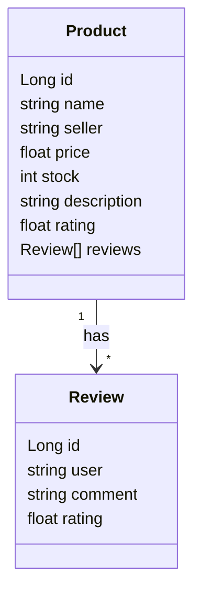

# products-api
Uma API REST simples para gerenciamento de produtos em um banco de dados de uma loja e-commerce. 

O repositório serve como meu envio para o desafio **'Publicando Sua API REST na Nuvem'** da DIO.

